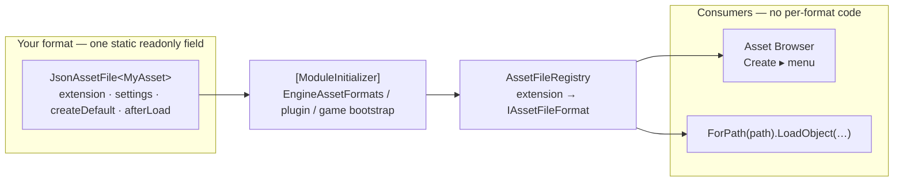

# Voltage Engine — Asset File Formats

How the engine's own asset file types work, and how to add your own — for engine contributors, plugin
authors, and game developers.

An **asset file format** is a file extension plus the code that turns that file into an object and back.
`.vtileset` and `.vtimeline` are the built-in examples. Both are built on one shared type,
`JsonAssetFile<T>`, so adding a format is roughly fifteen lines rather than a new copy of the same
load/save boilerplate.

---

## 1. The landscape

Voltage projects contain two kinds of file: **source assets** authored in other tools (`.png`,
`.aseprite`, `.ogg`, `.tmx`, `.fx`) and **native assets** the engine defines and owns.

| Extension | Backing type | Owner |
|---|---|---|
| `.voltage` | project metadata | `ProjectManager` |
| `.vscene` | `SceneData` | `Scene.LoadFromFile` |
| `.vprefab` | `PrefabData` | `SerializationManager` |
| `.vtileset` | `TilesetAsset` | `TilesetAssetIO` |
| `.vtimeline` | `TimelineAsset` | `TimelineAssetIO` |

`.vscene` and `.vprefab` are special-cased throughout the engine (entity graphs, prefab deltas, AOT scene
deserialization) and are **not** built on the pattern below. `.vtileset` and `.vtimeline` are — and so is
anything you add.

### Identity: GUIDs, not paths

Every file the editor indexes gets a stable GUID stored in a `.meta` sidecar next to it
(`AssetDatabase`). References store that GUID, so **renaming or moving an asset never breaks a
reference**. At build time the editor bakes a GUID→path map into `Data/assets.manifest`, which
`Voltage.Assets.AssetManifest` reads at runtime so published builds resolve the same way.

You get all of this for free. A new format needs no identity work of its own.

---

## 2. The pattern: `JsonAssetFile<T>`

Every JSON-backed, single-object asset format differs in only three things:

1. the file extension,
2. the `JsonSettings` used to encode and decode,
3. how a fresh default instance is built,

plus an optional post-load hook. `JsonAssetFile<T>` takes exactly those as constructor arguments and
supplies `CreateDefault` / `CreateAndSave` / `ToJson` / `FromJson` / `Save` / `Load`.



`IAssetFileFormat` is the non-generic view of a format (`Extension`, `DisplayName`, `AssetType`,
`LoadObject`, `SaveObject`, `CreateOptions`). It is what lets the editor treat every format uniformly:
the "Create ▸" submenu is a loop over `AssetFileRegistry.All`, not a hardcoded list.

---

## 3. Adding a format

### 3.1 Define the asset type

A plain class. No base class, no interface, no attributes required.

```csharp
namespace MyGame.Dialogue
{
    public class DialogueTable
    {
        public string Name;
        public string DefaultSpeaker = "Narrator";
        public List<DialogueLine> Lines = new();
    }

    public class DialogueLine
    {
        public string Key;
        public string Speaker;
        public string Text;
        public float  HoldSeconds = 2f;
    }
}
```

### 3.2 Declare the format and a facade

```csharp
using Voltage.Assets;

namespace MyGame.Dialogue
{
    public static class DialogueTableIO
    {
        public const string FileExtension = ".vdialogue";

        public static readonly JsonAssetFile<DialogueTable> Format = new(
            FileExtension,
            "Dialogue Table",
            createDefault: name => new DialogueTable { Name = name });

        public static DialogueTable Load(string path)               => Format.Load(path);
        public static void          Save(DialogueTable a, string p) => Format.Save(a, p);
        public static DialogueTable CreateAndSave(string path)      => Format.CreateAndSave(path);
    }
}
```

The static facade is optional — `DialogueTableIO.Format.Load(path)` works just as well — but it keeps
call sites short and gives you one place to add format-specific helpers.

**`createDefault`** receives the file name without its extension as a naming hint, or `null` when the
asset is created outside a file context. Use it to seed a `Name` field; ignore it if your type has none.

### 3.3 Register it

Registration must happen from a `[ModuleInitializer]`, not from a lazy static. See §5.1 for why.

```csharp
using System.Runtime.CompilerServices;
using Voltage.Assets;

namespace MyGame.Dialogue
{
    internal static class DialogueFormats
    {
        [ModuleInitializer]
        internal static void Install() => AssetFileRegistry.Register(DialogueTableIO.Format);
    }
}
```

This works from all three places code can live:

| Where your code lives | Does `[ModuleInitializer]` run? |
|---|---|
| **Engine** (`Voltage.Engine`) | Yes — but add your line to `EngineAssetFormats.RegisterAll()` instead, so all engine formats stay in one place |
| **Plugin** | Yes — `PluginManager` calls `RunModuleConstructor` on load, and `PluginBootstrap.g.cs` forces it in NativeAOT builds |
| **Game project** (`Scripts/`) | Yes — `ScriptManager` calls `RunModuleConstructor` after compiling your scripts |

That is the whole job. The format now appears under **Create ▸ Dialogue Table** in the Asset Browser
context menu, and `AssetFileRegistry.ForPath("…/Intro.vdialogue")` resolves it.

---

## 4. Using your asset

### 4.1 From a component

Declare an `AssetReference` field to get a drag-and-drop slot in the Inspector:

```csharp
public partial class DialoguePlayer : Component
{
    public AssetReference Table;      // drag a .vdialogue from the Asset Browser

    private DialogueTable _table;

    public override void OnStart()
    {
        var path = Table.ResolvePath();          // GUID-first; survives rename/move
        _table = DialogueTableIO.Load(path);
    }
}
```

`AssetReference` resolves GUID-first through the editor's `AssetDatabase` in play mode and through the
baked `assets.manifest` in a published build, falling back to the stored path.

### 4.2 Shipping the file

The generated `.csproj` copies `Content/**` and `Data/**` to the output with `PreserveNewest`. Keep
your assets under one of those two roots (`Scenes/` and `Prefabs/` already live inside `Data/`). A file
elsewhere — `Scripts/`, say — will work in the editor and then be **missing from the build**.

### 4.3 Optional: `Scene.LoadAsset<T>` support

`Core.Scene.LoadAsset<T>(reference)` routes through a loader table in `VoltageContentManager`
(`AssetLoaderTable`). That table is engine-internal, so wiring a new type into it is an engine change —
add one line:

```csharp
[typeof(DialogueTable)] = static (c, path, name, raw) => DialogueTableIO.Load(path),
```

Outside the engine, call your own `Load` as in §4.1. The only thing you give up is the shared
`LoadedAssets` cache, which you can replace with a `Dictionary<Guid, T>` of your own if the asset is
expensive.

---

## 5. Rules and gotchas

### 5.1 Register from a `[ModuleInitializer]`, never a lazy static

It is tempting to let `AssetFileRegistry` be populated as a side effect of the first touch of
`DialogueTableIO`. Do not — the registry would be **empty for any caller that arrives first**, and the
symptom is silent: a Create menu with missing entries, not an exception.

`AssetFileRegistry.EnsureEngineFormatsRegistered()` guards the engine's own formats on every read path
as a second line of defence, but that only covers formats listed in `EngineAssetFormats`. Your format
needs its own module initializer.

### 5.2 Polymorphic members need `TypeNameHandling.Auto`

The default settings are pretty-printed, **no type names**, no reference tracking — correct for a plain
data file. If a field's declared type is abstract or a base class (a `List<Track>` holding
`TransformTrack`s), the concrete type is lost on save unless you opt in:

```csharp
settings: new JsonSettings
{
    PrettyPrint = true,
    TypeNameHandling = TypeNameHandling.Auto,
    PreserveReferencesHandling = false,
}
```

This is what `.vtimeline` does. The encoder writes an `@type` hint per polymorphic value.

Two caveats. Type hints are **CLR type names**, so renaming or moving the class breaks existing files.
And resolving them uses reflection, which a NativeAOT build can trim — engine types survive because
`Voltage.dll` is preserved wholesale by `TrimmerRoots.xml`, but your own types need a trimmer root or a
`[DynamicDependency]`. Prefer concrete types where you can.

### 5.3 The post-load hook

`afterLoad` runs after a successful decode and is skipped when decoding yields null. Use it for anything
derived that deserialization cannot reconstruct:

```csharp
afterLoad: asset => asset.InvalidateEventOrder()
```

### 5.4 Icons and drop behaviour are editor-side

`AssetTypeRegistry` (in `Voltage.Editor`) maps an extension to its browser icon, its `AssetKind`, and its
drag-into-the-scene factory. It is currently populated by a private static constructor, so **only engine
and editor code can add entries**. A format registered from a plugin or a game project works fully — it
loads, saves, and appears in the Create menu — but shows the generic "unsupported" icon and cannot be
dropped into the viewport.

If you are adding a format inside the engine and want a proper icon, add a descriptor to
`AssetTypeRegistry`'s static constructor and an icon PNG under
`DefaultContent/UI/RemixIcon/FileTypes/`.

### 5.5 Saving is not atomic

`Save` is a plain `File.WriteAllText`. A crash mid-write truncates the file. This matches how scenes and
prefabs already behave; if your asset is large or precious, write to a temporary file and move it into
place yourself.

### 5.6 `Load` returns null for a missing file

It does not throw. Callers that need a hard failure should check.

---

## 6. Data assets (`.vasset`)

A **data asset** is a file holding shared, referenceable data with no entity, transform or update cost —
Voltage's equivalent of Unity's ScriptableObject. Difficulty tables, item definitions, loot tables,
dialogue data, tuning curves.

Unlike the formats above you do **not** write an IO class or a format descriptor. Declare a class; the
source generator does the rest.

### 6.1 Declaring one

```csharp
using System.Collections.Generic;
using Voltage;
using Voltage.Data;
using Voltage.Serialization;

[AssetTypeId("DifficultyProfile")]          // stamped automatically on first compile, then frozen
public partial class DifficultyProfile : DataAsset
{
    public string DisplayName = "Normal";
    public float  EnemyHealthMultiplier = 1f;
    public Tier   Aggression = Tier.Medium;
    public List<LootEntry> Loot = new();
    public AssetReference Portrait;

    public override void OnLoaded() { /* optional: derive caches, migrate old files */ }
}

public class LootEntry : ISerializableData    // nested data needs this marker
{
    public string Item;
    public int Weight = 1;
}
```

Requirements: **concrete**, **`partial`**, and a **public parameterless constructor**. The generator
emits a reflection-free reader into the partial half, which is what makes data assets load under
NativeAOT.

Create one in the editor with right-click ▸ **Create ▸ Data Asset ▸ &lt;your type&gt;**, and double-click it
to edit. One generic window serves every type, driven by the same inspectors the entity inspector uses —
enums, lists, colours, asset slots, nested types and `[Tooltip]` all work with no editor code.

### 6.2 Reading one

```csharp
public partial class Enemy : Component
{
    [AssetType(typeof(DifficultyProfile))]     // the slot only accepts this type
    public AssetReference Difficulty;

    private DifficultyProfile _profile;

    public override void OnStart()
        => _profile = DataAssets.Load<DifficultyProfile>(Difficulty);
}
```

`[AssetType]` makes the inspector filter its picker and **reject** a mismatched drag. It also accepts an
extension list — `[AssetType(".png", ".aseprite")]` — for source assets.

### 6.3 Sharing, and the one thing to watch

`Load` returns the **same instance** for the same asset. That is the point: edit the file, and every
consumer sees it. It also means a runtime mutation is visible everywhere.

- Need per-consumer state instead? Mark the type `[CloneOnLoad]` and each `Load` returns a fresh copy.
- In the editor, the loaded set is snapshotted on entering play mode and restored on exit, so gameplay
  mutation can never rewrite your authored values.

### 6.4 Swapping variants

A `DataAssetSet` maps keys to other data assets, so difficulty (or region, or platform tier) is authored
rather than coded:

```csharp
[AssetType(typeof(DataAssetSet))]
public AssetReference Stats;

public override void OnStart()
{
    _stats = DataAssets.LoadVariant<EnemyStats>(Stats);   // resolves DataVariant.Active
    DataVariant.Changed += ReloadStats;                   // remember to unsubscribe
}
```

Set `DataVariant.Active = "Hard"` once, from a menu. An unknown key falls back to the set's
`DefaultKey`. Adding a "Nightmare" tier is a row in an asset, not a code change. A slot expecting a set
also accepts a plain asset, so you can upgrade one-asset → set-of-variants without touching the reader.

### 6.5 Versioning and renaming

- Renaming the class or its namespace is safe — files store the `[AssetTypeId]`, not the type name.
- Renaming or moving the **file** is safe — references resolve by GUID.
- Changing fields: unknown keys in a file are skipped and missing ones keep their default, so adding and
  removing fields is non-breaking. For a real migration, bump `[AssetVersion(2)]` and branch on
  `LoadedVersion` inside `OnLoaded`.

### 6.6 Limits

- **Polymorphic fields are not supported.** A `List<Ability>` with an abstract element type will not
  round-trip. Use concrete types.
- **Only public members persist.** A private `[Serialize]` field is reported (VLT014) rather than
  silently dropped, because the writer is the reflection encoder, which only emits public members.
- Diagnostics: VLT010 duplicate id · VLT011 no public ctor · VLT012 not partial · VLT013 no members ·
  VLT014 non-public member · VLT015 missing `[AssetTypeId]`.

---

## 7. Reference

**`Voltage.Assets`** (`Voltage.Engine/Assets/`)

| Type | Purpose |
|---|---|
| `JsonAssetFile<TAsset>` | The shared load/save implementation. One `static readonly` instance per format. |
| `IAssetFileFormat` | Non-generic view: `Extension`, `DisplayName`, `AssetType`, `LoadObject`, `SaveObject`, `CreateOptions`. |
| `AssetCreateOption` | One entry in the Asset Browser's "Create ▸" menu: label, default file name, writer. |
| `AssetFileRegistry` | Extension → format lookup. `Register`, `ForExtension`, `ForPath`, `IsKnownAssetFile`, `All`. |
| `EngineAssetFormats` | `[ModuleInitializer]` that installs the built-in formats. Engine formats go here. |
| `AssetManifest` | Runtime GUID → path resolution from the baked `Data/assets.manifest`. |

**`Voltage.Data`** (`Voltage.Engine/Data/`)

| Type | Purpose |
|---|---|
| `DataAsset` | Base class for a `.vasset` data container. |
| `[AssetTypeId]` | Stable, rename-proof type id. Auto-stamped; frozen thereafter. |
| `[CloneOnLoad]` · `[AssetVersion]` | Opt out of instance sharing · declare a schema version. |
| `ISerializableData` | Marks a nested class as serializable (`IComponentGroup` derives from it). |
| `DataAssets` | `Load<T>`, `LoadVariant<T>`, `LoadFromPath<T>`. |
| `DataAssetIO` | Load/save, `PeekAssetTypeId` (header-only parse). |
| `DataAssetCache` | Shared-instance store; in-place reload; play-mode snapshot/restore. |
| `DataAssetRegistry` | id → type/factory/reader, populated by generated module initializers. |
| `DataAssetSet` · `DataVariant` | Key → asset mapping, and the globally active key. |
| `[AssetType]` | *(in `Voltage.Serialization`)* Constrains an `AssetReference` inspector slot. |

**Multiple create options.** `CreateOptions` defaults to a single "New &lt;DisplayName&gt;" entry. A
format whose files come in several flavours can implement `IAssetFileFormat` directly and return one
option per flavour — the Asset Browser renders those as a nested submenu automatically.

---

## See also

- [`vasset-plan.md`](vasset-plan.md) — the `.vasset` data-container (ScriptableObject-equivalent) plan.
  Phase 0 shipped the pattern documented above; Phases 1–6 build user-declared data assets, typed
  inspector slots, and difficulty/region variant swapping on top of it.
- [`../cinematics/timeline-review.md`](../cinematics/timeline-review.md) — how the Timeline system compares
  to other engines, and how it interacts with data assets
- [`../plugins/README.md`](../plugins/README.md) — shipping a format (and its editor tooling) as a plugin
- `FAQs/ContentManagement.md` — the `ContentManager` layer for source assets (textures, audio, effects)
